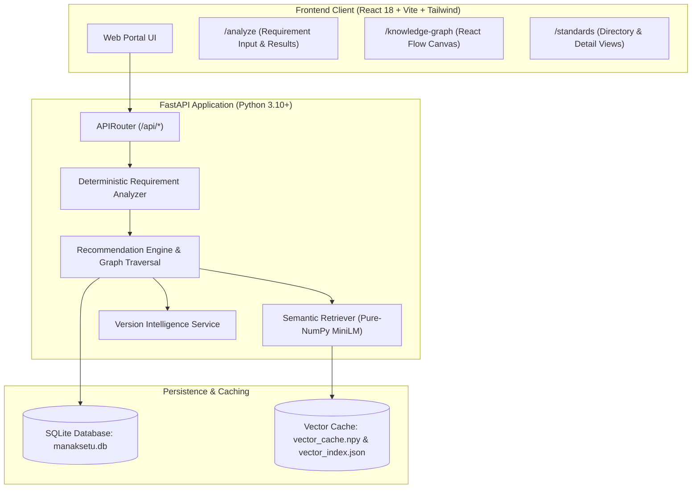
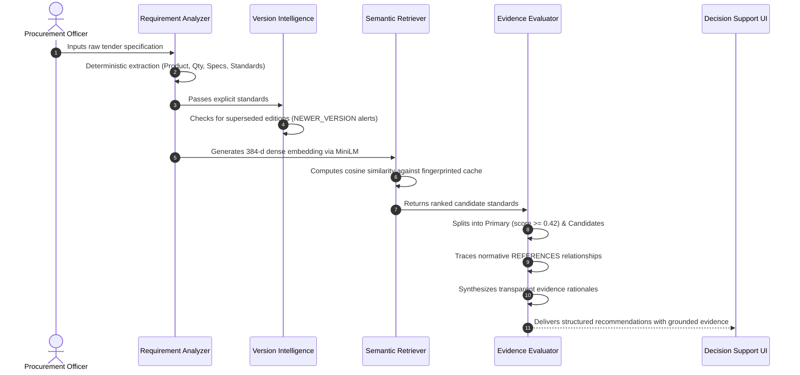

# ManakSetu (मानकसेतु)
### *From Requirement to the Right Standard*

[](https://github.com/purohitkaran07/ManakSetu/actions/workflows/ci.yml)
[](https://fastapi.tiangolo.com)
[](https://react.dev)
[](https://www.typescriptlang.org)
[](https://www.python.org)
[](LICENSE)
[](#authoritative-bis-reference-notice)

> **ManakSetu** is an AI-powered Indian Standards Decision Support System designed to bridge the gap between natural-language public procurement requirements and technical Indian Standards (BIS). Developed as an institutional prototype for Smart India Hackathon (SIH) 2026.

---

## Table of Contents
- [1. Problem Statement](#1-problem-statement)
- [2. Why ManakSetu Exists](#2-why-manaksetu-exists)
- [3. Core Capabilities](#3-core-capabilities)
- [4. Application Previews](#4-application-previews)
- [5. System Architecture](#5-system-architecture)
- [6. AI Recommendation Pipeline](#6-ai-recommendation-pipeline)
- [7. Technology Stack](#7-technology-stack)
- [8. Requirement Analyzer Engine](#8-requirement-analyzer-engine)
- [9. Semantic Retrieval Engine](#9-semantic-retrieval-engine)
- [10. Knowledge Graph & Lineage](#10-knowledge-graph--lineage)
- [11. Version Intelligence](#11-version-intelligence)
- [12. Anti-Hallucination Design](#12-anti-hallucination-design)
- [13. API Overview](#13-api-overview)
- [14. Repository Structure](#14-repository-structure)
- [15. Installation & Setup](#15-installation--setup)
- [16. Development Setup](#16-development-setup)
- [17. Testing Suite](#17-testing-suite)
- [18. Deployment](#18-deployment)
- [19. Demonstration Scenarios](#19-demonstration-scenarios)
- [20. Scope & Limitations](#20-scope--limitations)
- [21. Authoritative BIS Reference Notice](#21-authoritative-bis-reference-notice)
- [22. License](#22-license)

---

## 1. Problem Statement

Public procurement tenders published on government portals (e.g., GeM, state procurement boards, municipal corporations) are authored in descriptive natural language:

> *"We need to procure 500 wall-mounted 25 litre electric storage water heaters for government hostels."*

Conversely, the national standards repository published by the **Bureau of Indian Standards (BIS)** consists of thousands of highly structured, technical specifications indexed by numerical codes (e.g., `IS 2082:2018`, `IS 302 (Part 2/Sec 21):2024`).

This disconnect creates severe operational risks for procurement officers and engineers:
1. **Discovery Hurdles:** Keyword searching often misses the exact governing standard when terminology differs.
2. **Omitted Companion Standards:** Product specifications typically normatively invoke horizontal electrical safety and component standards that non-specialist buyers omit from tenders.
3. **Obsolete Standard Citations:** Tenders frequently cite superseded standards (e.g., citing a 2018 edition replaced in 2024), risking audit objections, contractor disputes, and compromised public safety.
4. **LLM Hallucinations:** Generative AI tools often invent fictitious standard numbers or guess missing technical parameters without regulatory grounding.

---

## 2. Why ManakSetu Exists

ManakSetu provides an intelligent, explainable decision-support layer between tender authors and the Indian Standards ecosystem.

```
+-------------------------------------------------------------------------+
|                  BUREAU OF INDIAN STANDARDS (BIS)                       |
|               Authoritative National Standards Body                     |
+-------------------------------------------------------------------------+
                                    ▲
                                    │ (Standard Reference Knowledge)
+-------------------------------------------------------------------------+
|                         MANAKSETU (मानकसेतु)                            |
|             AI Standards Decision Support & Lineage Engine              |
|  • Parameter Extraction      • 384-d Semantic Retrieval                 |
|  • Normative Traversal       • Strict Version Intelligence              |
|  • Grounded Evidence         • Zero-Hallucination Guardrails            |
+-------------------------------------------------------------------------+
                                    ▲
                                    │ (Tender Clauses & Procurement Specs)
+-------------------------------------------------------------------------+
|              PUBLIC PROCUREMENT OFFICERS & TENDER AUTHORITIES           |
+-------------------------------------------------------------------------+
```

---

## 3. Core Capabilities

- **Deterministic Parameter Extraction:** Accurately extracts product names, quantities, capacities, electrical ratings, dimensions, installation types, and explicit standard citations without guessing.
- **PDF Requirement Upload:** Ingests official tender documents and specification sheets in PDF format with in-memory selectable text extraction via `pypdf`.
- **Pure-NumPy 384-d Semantic Retrieval:** Employs `sentence-transformers/all-MiniLM-L6-v2` with a custom pure-NumPy inference engine that runs in ~80 MB RAM (ideal for resource-constrained free-tier cloud deployments).
- **Normative Reference Traversal:** Automatically navigates `REFERENCES` relationships to surface companion safety standards (`IS 302 Part 1`) and component controls (`IS/IEC 60730`).
- **Proactive Version Intelligence:** Identifies cited superseded standards and produces prominent `NEWER_VERSION` deprecation alerts directing officers to the active revision.
- **Traceable Grounded Evidence:** Every recommendation is backed by transparent explanations citing title alignment, product classification, and normative lineage.
- **Client-Side PDF Report Export:** Instant one-click download of formal, government-styled PDF analysis reports powered by `jsPDF` without server latency.
- **Zero-Match Protection:** Unrelated domain queries (e.g., *Portland cement* against an electrotechnical slice) yield zero false recommendations.


---

## 4. Application Previews

| Portal Landing Page | Requirement Analyzer |
| :---: | :---: |
|  |  |
| *Institutional Government UI with quick pathways* | *Parameter extraction with preset test clauses* |

| Grounded Recommendations | Interactive Knowledge Graph |
| :---: | :---: |
|  |  |
| *Primary recommendations, evidence pills & alerts* | *Interactive React Flow visual standards network* |

> *Note: For instructions on capturing or updating screenshot assets, refer to [`images/README.md`](images/README.md).*

---

## 5. System Architecture

ManakSetu is engineered as a decoupled modern web platform:



*For comprehensive architecture documentation, see [`docs/architecture.md`](docs/architecture.md).*

---

## 6. AI Recommendation Pipeline

The recommendation engine executes a 4-stage pipeline:



*For technical pipeline specifications, see [`docs/ai-pipeline.md`](docs/ai-pipeline.md).*

---

## 7. Technology Stack

| Domain | Technology | Purpose |
| :--- | :--- | :--- |
| **Frontend** | React 18.3, TypeScript 5.7 | Robust, strictly-typed Single Page Application |
| **Bundler** | Vite 6 | High-speed ESM bundling and development proxy |
| **Styling** | Tailwind CSS 3.4 | Government of India institutional blue design system |
| **Graph UI** | `@xyflow/react` (React Flow v12) | Node-and-edge interactive knowledge graph canvas |
| **Backend** | Python 3.10+, FastAPI 0.110+ | High-performance asynchronous REST API framework |
| **Server** | Uvicorn | Production ASGI server with uvloop |
| **Database** | SQLAlchemy 2.0, SQLite | ORM modeling and lightweight relational storage |
| **AI Embeddings** | `sentence-transformers/all-MiniLM-L6-v2` | 384-dimensional dense semantic vector space |
| **AI Inference** | Custom Pure-NumPy Engine | ~80 MB RAM execution avoiding heavy PyTorch dependencies |

---

## 8. Requirement Analyzer Engine

Located in [`backend/app/ai/requirement_analyzer.py`](backend/app/ai/requirement_analyzer.py), the `DeterministicRequirementAnalyzer` performs deterministic extraction:
- **Standards Recognition:** Verbatim extraction of formal Indian Standards (`IS 2082:2018`, `IS 302`, `IS/IEC 60730`).
- **Quantities:** Numerical count matching (`500 wall-mounted`, `120 nos`, `quantity: 100`).
- **Specifications:** Dynamic dimension, power, capacity, and pressure patterns (`25 litre`, `1200 mm sweep`, `100 watt`, `5 bar`, `1400 rpm`).
- **Context:** Installation methods (`wall-mounted`), application domains (`hostels`), and procurement environments (`government`).
- **Anti-Speculation:** Only attributes explicitly present in text are captured; absent parameters remain `null`.

---

## 9. Semantic Retrieval Engine

Located in [`backend/app/ai/vector_store.py`](backend/app/ai/vector_store.py):
- **Model:** `sentence-transformers/all-MiniLM-L6-v2`.
- **Pure-NumPy Engine:** Direct forward-pass evaluation of safetensors weights without PyTorch runtime overhead.
- **SHA-256 Fingerprint Caching:** Precomputed embeddings are stored in `vector_cache.npy`. The cache is guarded by a SHA-256 hash calculated over 9 metadata fields across all database standards. Modifying any standard automatically invalidates and regenerates the cache.
- **Query Cache:** Capped in-memory cache (`_MAX_QUERY_CACHE = 20`) for sub-millisecond retrieval of frequent queries.

---

## 10. Knowledge Graph & Lineage

The knowledge graph represents technical relationships between standards:
- **`REFERENCES`:** Technical or safety standard normatively invoked by another standard (e.g., `IS 2082:2018` $\rightarrow$ `IS 302 (Part 2/Sec 21):2024`).
- **`SUPERSEDES`:** Newer standard revision replacing an obsolete edition (e.g., `IS 302 (Part 2/Sec 21):2024` $\rightarrow$ `IS 302 (Part 2/Sec 21):2018`).

Interactive visual navigation is available via the **Knowledge Graph** tab (`/knowledge-graph`), powered by `@xyflow/react`.

*For complete knowledge base documentation, see [`docs/knowledge-base.md`](docs/knowledge-base.md).*

---

## 11. Version Intelligence

When a user's requirement explicitly cites an obsolete or superseded standard:
1. The engine extracts the verbatim standard code and year.
2. The `VersionService` traverses outgoing `SUPERSEDES` relationships.
3. A prominent `NEWER_VERSION` alert is emitted, advising the officer that the 2018 edition is superseded by the 2024 revision.
4. The system refuses to recommend superseded standards as primary recommendations.

---

## 12. Anti-Hallucination Design

ManakSetu enforces strict guardrails to prevent AI hallucinations:
1. **Zero Parameter Guessing:** Missing quantities or capacities are never filled with defaults.
2. **Relevance Thresholding:** Standards must meet a strict cosine similarity threshold ($\ge 0.42$) to qualify as a Primary Recommendation.
3. **Out-of-Domain Rejection:** Requirements outside the indexed slice (e.g., *"300 bags of Portland cement"*) yield **0 recommendations**, preventing false citations.

---

## 13. API Overview

| Method | Endpoint | Description |
| :---: | :--- | :--- |
| `GET` | `/api/health` | Service health, database status, standards count, model status |
| `POST` | `/api/extract-pdf` | In-memory extraction of selectable text from uploaded PDF tenders |
| `POST` | `/api/analyze` | Natural language requirement analysis & evidence-backed recommendations |
| `GET` | `/api/standards` | List indexed standards with search and category filters |
| `GET` | `/api/standards/{id}` | Detailed standard view including scope, committee, and metadata |
| `GET` | `/api/standards/{id}/relationships` | Direct incoming and outgoing normative relationships |
| `GET` | `/api/graph` | Formatted node and edge data for React Flow visualization |
| `GET` | `/api/history` | Chronological log of recent requirement evaluations |


*For complete endpoint documentation with example JSON payloads, see [`docs/api.md`](docs/api.md).*

---

## 14. Repository Structure

```
ManakSetu/
├── backend/
│   ├── app/
│   │   ├── ai/              # MiniLM engine, requirement analyzer, vector store
│   │   ├── api/             # FastAPI routers (health, analyze, standards, graph, history)
│   │   ├── models/          # SQLAlchemy database models
│   │   ├── schemas/         # Pydantic v2 validation schemas
│   │   ├── seed/            # Standards dataset & seed scripts
│   │   ├── services/        # Recommendation engine, semantic engine, version service
│   │   ├── database.py      # SQLAlchemy session factory
│   │   └── main.py          # FastAPI application entrypoint & lifespan
│   ├── data/                # SQLite DB and vector cache files
│   ├── requirements.txt     # Python backend dependencies
│   └── tests/               # Pytest test suite (16 tests)
├── frontend/
│   ├── public/              # Static assets, Indian Government & BIS logos
│   ├── src/                 # React 18 TypeScript source code
│   │   ├── components/      # UI components (Navbar, Footer, Standards, Graph, Home)
│   │   ├── pages/           # Route views (Home, Analyze, Standards, Detail, Graph, About, History)
│   │   ├── services/        # Axios API client
│   │   └── types/           # TypeScript interfaces matching backend models
│   ├── package.json         # Node.js dependencies & scripts
│   └── vite.config.ts       # Vite configuration
├── docs/                    # In-depth technical documentation
│   ├── architecture.md      # System architecture & component design
│   ├── api.md               # REST API reference
│   ├── ai-pipeline.md       # 4-stage decision-support pipeline
│   ├── knowledge-base.md    # Curated standards corpus & schema
│   └── deployment.md        # Vercel and Render deployment guide
├── images/                  # Application screenshot capture guide & images
├── scripts/                 # Standalone reproducible setup scripts
│   ├── seed_database.py     # Database table initializer & seeder
│   └── build_vectors.py     # Semantic vector cache precomputer
├── .github/workflows/       # GitHub Actions CI workflow
├── .env.example             # Environment configuration template
├── .gitignore               # Clean repository exclusions
├── LICENSE                  # MIT Open Source License
├── README.md                # Project documentation
├── DEMO.md                  # SIH Judge Demonstration Guide
├── DEVELOPMENT.md           # Developer onboarding manual
├── pytest.ini               # Pytest configuration
├── run_dev.bat              # Portable Windows development runner
└── vercel.json              # Vercel SPA rewrite rules
```

---

## 15. Installation & Setup

### Prerequisites
- **Python:** 3.10+ (tested up to Python 3.14)
- **Node.js:** 18.0+ and npm

### 1. Backend Setup
```bash
# Clone the repository
git clone https://github.com/purohitkaran07/ManakSetu.git
cd ManakSetu

# Create virtual environment
python -m venv venv

# Activate virtual environment
# Windows (PowerShell):
.\venv\Scripts\Activate.ps1
# Linux / macOS:
source venv/bin/activate

# Install dependencies
pip install -r backend/requirements.txt

# Seed the database
python scripts/seed_database.py

# Precompute vector cache
python scripts/build_vectors.py

# Start FastAPI server (http://127.0.0.1:8000)
python -m uvicorn app.main:app --app-dir backend --host 127.0.0.1 --port 8000 --reload
```

### 2. Frontend Setup
```bash
# In a new terminal:
cd frontend

# Install npm packages
npm install

# Start Vite development server (http://localhost:5173)
npm run dev
```

---

## 16. Development Setup

### Portable Windows One-Click Runner
For Windows developers, a portable startup script is available at the repository root:
```cmd
run_dev.bat
```
This script checks that Python and Node.js are available in your `PATH` and concurrently launches both the FastAPI backend and Vite frontend in dedicated terminal windows.

*For detailed contributor guidelines, see [`DEVELOPMENT.md`](DEVELOPMENT.md).*

---

## 17. Testing Suite

The backend includes a comprehensive Pytest test suite covering entity extraction, semantic retrieval, version alerts, normative traversal, and API endpoints:

```bash
# Run full backend test suite (16 tests)
python -m pytest backend/tests -v
```

Expected result:
```
======================= 16 passed in 4.33s =======================
```

### Frontend Build Verification
```bash
cd frontend
# TypeScript verification (0 errors)
npx tsc --noEmit

# Production bundle compilation
npm run build
```

---

## 18. Deployment

- **Frontend:** Deployed to **Vercel** as an SPA with client-side rewrites configured in [`vercel.json`](vercel.json).
- **Backend:** Deployed to **Render** (`https://manaksetu-api.onrender.com`) as a FastAPI web service with memory-optimized pure-NumPy inference.

*For step-by-step production deployment instructions, see [`docs/deployment.md`](docs/deployment.md).*

---

## 19. Demonstration Scenarios

We have prepared **six reproducible evaluation scenarios** for hackathon judges and evaluators:

1. **Full Procurement Specification:** `"500 wall-mounted 25 litre electric storage water heaters for government hostels"`
2. **Minimal Requirement Without Fabrication:** `"Need water heaters."`
3. **Outdated Explicit Standard Citation:** `"Procure stationary storage water heaters complying with IS 302 (Part 2/Sec 21):2018."`
4. **Clean Requirement Without False Alarms:** `"We need a 25 litre electric water heater for residential quarters."`
5. **Zero-Match Domain Control:** `"300 bags of grade 43 ordinary portland cement for boundary wall."`
6. **Knowledge Graph Exploration:** Visual traversal of normative dependencies and superseded standards.

*For complete evaluation walkthroughs, input text, and expected results, see [`DEMO.md`](DEMO.md).*

---

## 20. Scope & Limitations

- **Curated Demonstration Knowledge Base:** The current prototype slice indexes 6 verified Indian Standards and 4 normative relationships centering on electric storage water heaters, electrical appliance safety, and automatic controls. It demonstrates the technical architecture but does not index all 20,000+ standards published by BIS.
- **Decision-Support Advisory Only:** ManakSetu provides evidence-based recommendations, candidate ranking, and version lineage. It does not issue official compliance certificates or replace formal BIS conformity assessment procedures.

---

## 21. Authoritative BIS Reference Notice

> [!IMPORTANT]
> **Authoritative Reference Knowledge Notice:**  
> ManakSetu is an AI decision-support prototype created for Smart India Hackathon (SIH) 2026. **ManakSetu is NOT an official portal of the Bureau of Indian Standards (BIS) or the Government of India.**
>
> All recommendations represent *potentially applicable standards* identified through semantic retrieval, entity matching, and normative relationship traversal. Final technical compliance, certification schemes (e.g., BIS Scheme-I), and Quality Control Orders (QCOs) must be verified against official publications issued by the **Bureau of Indian Standards** ([www.bis.gov.in](https://www.bis.gov.in)) and the relevant Line Ministries of the Government of India.

---

## 22. License

This project is licensed under the **MIT License**. See the [`LICENSE`](LICENSE) file for details.
