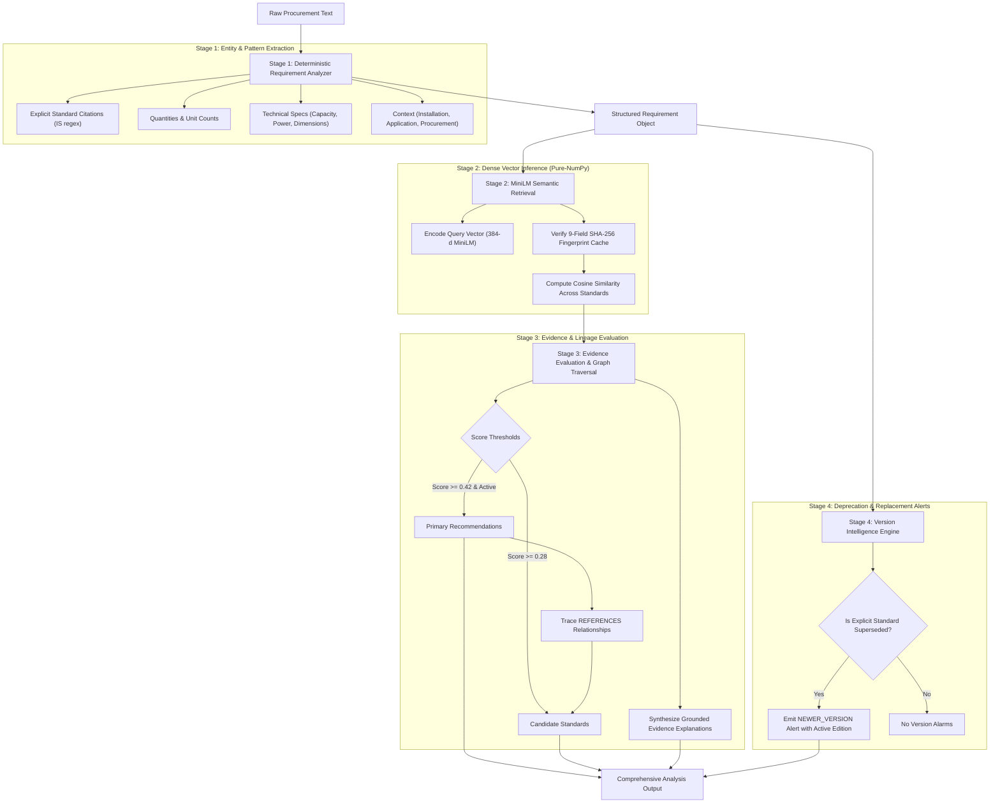

# AI & Decision Support Pipeline

ManakSetu operates a four-stage decision-support pipeline designed to balance linguistic flexibility, mathematical precision, resource efficiency, and strict regulatory reliability.



---

## Stage 1: Deterministic Requirement Analyzer

Public procurement demands exactness. Unlike generative models that frequently fabricate plausible model numbers or guess missing quantities, ManakSetu's `DeterministicRequirementAnalyzer` operates on deterministic rules and verified regular expressions.

### Key Extraction Modules:
1. **Explicit Standards Recognition (`STANDARD_PATTERN`):**
   ```python
   re.compile(r"\b(IS(?:/IEC)?\s+\d+(?:\s*\([^)]+\))*(?::\d{4})?)\b", re.IGNORECASE)
   ```
   Matches formal Indian Standards (e.g., `IS 2082:2018`, `IS 302 (Part 2/Sec 21):2024`, `IS/IEC 60730 (Part 1):1999`).
2. **Quantity Extraction (`QUANTITY_PATTERNS`):**
   Extracts counts associated with verbs (`procure`, `order`, `supply`, `quantity: 500`) and unit suffixes (`500 units`, `120 nos`, `75 pieces`).
3. **Generic Measurement & Technical Specification Patterns:**
   - **Capacity / Volume:** `\b(\d+(?:\.\d+)?)\s*(?:litres?|liters?|ltrs?|l|kl|ml)\b`
   - **Power Rating:** `\b(\d+(?:\.\d+)?)\s*(?:watts?|w|kw|mw|hp)\b`
   - **Voltage:** `\b(\d+(?:\.\d+)?)\s*(?:volts?|v|kv)\b`
   - **Dimensions & Sweep:** `\b(\d+(?:\.\d+)?)\s*(?:mm\s+sweep|mm|cm|meters?|metres?|m|inches?|inch)\b`
   - **Operating Pressure:** `\b(\d+(?:\.\d+)?)\s*(?:bar|psi|kpa)\b`
   - **Rotational Speed:** `\b(\d+(?:\.\d+)?)\s*(?:rpm)\b`
4. **Contextual Classification:**
   Identifies installation types (`wall-mounted`, `ceiling-mounted`, `floor-standing`), application domains (`hostel`, `hospital`, `municipal road`), and procurement contexts (`government`, `tender`, `public works`).

---

## Stage 2: Pure-NumPy MiniLM Semantic Retrieval

### Why Pure-NumPy?
Standard deep-learning frameworks like PyTorch, Transformers, and Sentence-Transformers require heavy shared libraries (`torch.dll` / `libtorch.so`) and consume **1.2 GB to 1.6 GB of RAM** just on import. On containerized free tiers (such as Render's 512 MB memory ceiling), running PyTorch leads to immediate Out-Of-Memory (OOM) termination.

ManakSetu implements `MiniLMInferenceEngine` in `backend/app/ai/vector_store.py`:
- Loads safetensors model weights directly using `safetensors.numpy`.
- Tokenizes via the Rust-backed `tokenizers` engine.
- Executes the full 6-layer Transformer feed-forward and multi-head attention stack in pure NumPy with vector arithmetic.
- Applies mean pooling and L2 normalization:
  $$\mathbf{u} = \frac{\sum_{i=1}^L \mathbf{h}_i \cdot m_i}{\sum_{i=1}^L m_i}, \quad \hat{\mathbf{u}} = \frac{\mathbf{u}}{\|\mathbf{u}\|_2}$$
- **Total RAM Footprint:** **~80 MB** (93% memory reduction with identical mathematical embedding outputs).

### Fingerprint-Guarded Caching
Embeddings for the standards corpus are precomputed and cached in `backend/data/vector_cache.npy` and `backend/data/vector_index.json`.

Before reading the cache, `VectorStore` computes a SHA-256 fingerprint over 9 distinct attributes of all standards in the database:
- `id`, `standard_number`, `title`, `scope`, `standard_type`, `classification`, `certification_status`, `source_reference`, `status`, `year`.

If any standard's text, title, or scope is modified, the SHA-256 hash changes, automatically invalidating stale cache files and triggering a clean recomputation.

---

## Stage 3: Evidence Evaluation & Candidate Ranking

Rather than dumping raw similarity scores, the `RecommendationEngine` evaluates candidate standards through multi-dimensional criteria:

| Category | Qualification Criteria | Role in Analysis |
| :--- | :--- | :--- |
| **Primary Recommendations** | Cosine Score $\ge 0.42$ AND `status == "Active"` (OR explicit reference) | Core applicable standards that directly govern the procurement item. |
| **Candidate Standards** | Cosine Score $\ge 0.28$ OR normatively referenced by a Primary standard | Secondary, safety, control, or related standards necessary for complete compliance. |

### Normative Traversal
If a primary recommendation (such as `IS 2082:2018`) has an outgoing `REFERENCES` relationship to another standard (such as `IS 302 (Part 2/Sec 21):2024` or `IS/IEC 60730`), the engine automatically pulls the referenced standard into the candidate set, ensuring procurement officers do not overlook mandatory companion standards.

### Grounded Evidence Synthesis
For every selected standard, the engine compiles traceable rationales:
- Technical scope and keyword overlap with the extracted product.
- Classification category match (e.g., *Electrical & Electronics*).
- Explicit citation confirmation if mentioned in the user's input.
- Normative reference linkages.

---

## Stage 4: Strict Version Intelligence

A frequent and costly error in public procurement is citing obsolete or superseded standard editions in tender specifications (e.g., citing the 2018 edition of a safety standard that was superseded in 2024).

The `VersionService` inspects all explicitly mentioned standard numbers:
1. Queries the relationship graph for outgoing `SUPERSEDES` relationships where the target is the cited standard.
2. Checks whether a newer edition exists in the knowledge base.
3. If an outdated edition is cited, generates a high-priority `NEWER_VERSION` alert:
   > **Alert:** *"Your requirement explicitly mentions IS 302 (Part 2/Sec 21):2018. Note that this edition is superseded by IS 302 (Part 2/Sec 21):2024."*
4. **Anti-Hallucination Guardrail:** For general requirements without explicit version citations (e.g., *"We need a 25L water heater"*), the version intelligence service emits **zero** false alarms.
