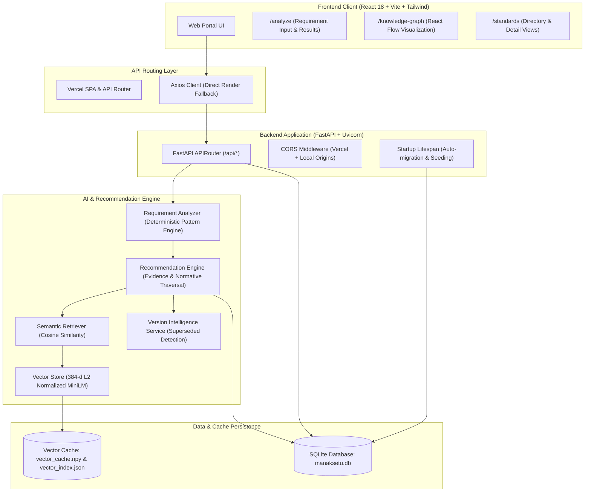
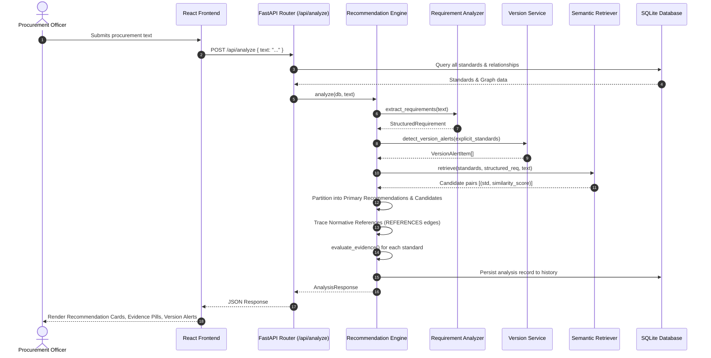

# System Architecture

ManakSetu (*मानकसेतु*) is an AI-powered Indian Standards Decision Support System developed as an institutional decision-support prototype for public procurement and engineering compliance.

It transforms unconstrained natural-language procurement requirements and tender clauses into verified, evidence-grounded Indian Standards (BIS) recommendations with normative relationship tracing and version intelligence.



---

## 1. Architectural Principles

1. **Deterministic Extraction Over Speculation:**  
   Procurement parameters (quantities, capacities, dimensions, voltages, explicit standard numbers) are extracted using rigorous regex and linguistic pattern recognition. If a parameter is absent, the engine leaves it empty rather than hallucinating plausible values.
2. **Resource-Constrained Deep Inference:**  
   Instead of loading heavy PyTorch and Transformers runtimes (~1.2 GB RAM), ManakSetu incorporates `MiniLMInferenceEngine`, a pure-NumPy implementation of `sentence-transformers/all-MiniLM-L6-v2`. It consumes ~80 MB RAM, executing seamlessly on resource-constrained cloud environments (such as Render's 512 MB free tier).
3. **Evidence-Grounded Recommendations:**  
   Every recommendation is paired with transparent, explainable evidence: product scope overlap, classification alignment, explicit citations, and normative reference lineage.
4. **Strict Version Intelligence:**  
   Outdated standards cited in requirements (e.g., `IS 302 (Part 2/Sec 21):2018`) trigger explicit `NEWER_VERSION` warnings directing officers to the active revision (`2024 edition`).

---

## 2. Tier Breakdown

### 2.1. Frontend Tier
- **Framework:** React 18.3 with TypeScript 5.7
- **Build System:** Vite 6
- **Styling:** Tailwind CSS 3.4 implementing the official Government of India / BIS institutional visual language (Government Navy `#1e3a8a`, Institutional Blue `#2563eb`, Tri-color saffron/green accents).
- **Routing:** React Router v6 with SPA client-side routing.
- **Graph Visualization:** `@xyflow/react` (React Flow v12) rendering interactive nodes, status indicators, and normative reference edges.
- **API Client:** Axios instance in `frontend/src/services/api.ts` with automated environment resolution (`VITE_API_URL` override -> direct Render production backend -> `/api` dev proxy).

### 2.2. Backend Tier
- **Framework:** FastAPI 0.110+ on Python 3.10+
- **ASGI Server:** Uvicorn with standard uvloop and httptools.
- **ORM / Persistence:** SQLAlchemy 2.0 with SQLite database (`backend/data/manaksetu.db`).
- **Validation:** Pydantic v2 data models ensuring strict input/output contracts.
- **CORS Architecture:** Configured for cross-origin communication across local Vite servers and production Vercel subdomains (`https://*.vercel.app`) with credentials support.

### 2.3. AI & Decision Support Tier
- **Embedding Model:** `sentence-transformers/all-MiniLM-L6-v2` generating 384-dimensional dense semantic vectors.
- **Fingerprinted Vector Cache:** Vector cache files (`vector_cache.npy` and `vector_index.json`) are tagged with a strict SHA-256 fingerprint across 9 metadata attributes of all standards. If the standards table changes, the cache invalidates and rebuilds automatically.
- **Query Cache:** In-memory LRU cache (`_MAX_QUERY_CACHE = 20`) preventing redundant vector encoding for repeated query strings.

---

## 3. End-to-End Analysis Sequence



---

## 4. Directory Organization

```
ManakSetu/
├── backend/
│   ├── app/
│   │   ├── ai/              # MiniLM engine, requirement analyzer, vector store
│   │   ├── api/             # FastAPI endpoint routers (health, analyze, standards, graph, history)
│   │   ├── models/          # SQLAlchemy ORM database models
│   │   ├── schemas/         # Pydantic v2 schemas (requests, responses, graphs)
│   │   ├── seed/            # Seed data and database seeding logic
│   │   ├── services/        # Recommendation engine, semantic engine, version service
│   │   ├── database.py      # SQLAlchemy engine and session factory
│   │   └── main.py          # FastAPI application entrypoint and lifespan
│   ├── data/                # SQLite DB and vector cache files
│   ├── requirements.txt     # Backend Python dependencies
│   └── tests/               # Backend Pytest test suites (16 tests)
├── frontend/
│   ├── public/              # Static assets, Indian Government & BIS logos
│   ├── src/
│   │   ├── components/      # UI components (Navbar, Footer, Standards, Graph, Home)
│   │   ├── pages/           # Route views (Home, Analyze, Standards, Detail, Graph, About, History)
│   │   ├── services/        # Axios API client and backend connectivity
│   │   ├── types/           # TypeScript interfaces matching backend schemas
│   │   ├── App.tsx          # Root router and layout
│   │   └── main.tsx         # React DOM mounting
│   ├── package.json         # Node.js dependencies and build scripts
│   └── vite.config.ts       # Vite bundler and development proxy config
├── docs/                    # Technical documentation
├── images/                  # Screenshot capture guide and image assets
├── scripts/                 # Standalone reproducible setup scripts
├── .github/workflows/       # GitHub Actions CI workflow
├── .env.example             # Environment variable template
├── .gitignore               # Clean Git exclusions
├── LICENSE                  # MIT Open Source License
├── README.md                # Project landing documentation
├── DEMO.md                  # SIH Judge Demonstration Guide
├── DEVELOPMENT.md           # Developer onboarding and environment guide
├── pytest.ini               # Pytest configuration
├── run_dev.bat              # Portable Windows development runner
└── vercel.json              # Vercel SPA rewrite configuration
```
