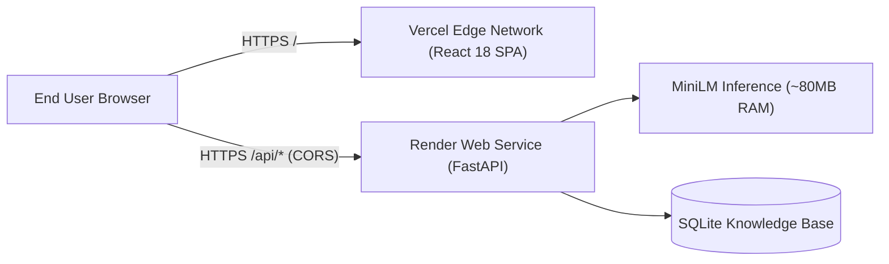

# Deployment Guide

ManakSetu is architected for decoupled, production-grade cloud deployment:
- **Frontend:** Hosted on **Vercel** as a static Single Page Application (SPA).
- **Backend:** Hosted on **Render** as a Python FastAPI ASGI web service (`https://manaksetu-api.onrender.com`).



---

## 1. Frontend Deployment (Vercel)

### 1.1. Project Configuration
- **Framework Preset:** Vite
- **Root Directory:** `frontend` (or repository root with root `vercel.json`)
- **Build Command:** `npm run build`
- **Output Directory:** `dist`
- **Node.js Version:** `20.x` or `18.x`

### 1.2. Client-Side Routing & SPA Rewrites
To ensure that deep URLs (such as `/analyze`, `/standards/1`, `/knowledge-graph`) resolve correctly when refreshed, both [`vercel.json`](../vercel.json) and [`frontend/vercel.json`](../frontend/vercel.json) specify SPA fallback rewrites:

```json
{
  "rewrites": [
    {
      "source": "/api/:path*",
      "destination": "https://manaksetu-api.onrender.com/api/:path*"
    },
    {
      "source": "/(.*)",
      "destination": "/index.html"
    }
  ]
}
```

### 1.3. Direct API Connection Architecture
In production builds, [`frontend/src/services/api.ts`](../frontend/src/services/api.ts) dynamically connects directly to `https://manaksetu-api.onrender.com/api`. This eliminates intermediate Vercel serverless proxy timeouts (which cap at 10 seconds), ensuring smooth handling even when Render is completing an initial cold-start wake-up.

---

## 2. Backend Deployment (Render)

### 2.1. Web Service Settings
- **Environment:** `Python 3`
- **Root Directory:** Repository root
- **Build Command:**
  ```bash
  pip install -r backend/requirements.txt && python scripts/seed_database.py && python scripts/build_vectors.py
  ```
- **Start Command:**
  ```bash
  uvicorn app.main:app --host 0.0.0.0 --port $PORT --app-dir backend
  ```

### 2.2. Environment Variables
| Variable | Value / Default | Description |
| :--- | :--- | :--- |
| `PYTHON_VERSION` | `3.11.0` | Python runtime version. |
| `PORT` | Set automatically by Render | Server listening port. |
| `DATABASE_URL` | `sqlite:///backend/data/manaksetu.db` | Database connection string. |
| `LLM_PROVIDER` | `none` | Deterministic entity extraction mode. |

### 2.3. Memory Optimization on Render Free Tier
Render free instances enforce a strict **512 MB RAM limit**. Standard deep-learning packages (PyTorch + Transformers) require over 1.2 GB of memory on import, leading to instant SIGKILL OOM termination.

ManakSetu solves this completely with `MiniLMInferenceEngine`:
- Pure-NumPy inference with official safetensors weights.
- Memory consumption remains stable at **~80 MB**, well below the 512 MB ceiling.
- Process-level singleton pattern prevents duplicate weight loading across requests.
- In-memory query caching is bounded by `_MAX_QUERY_CACHE = 20`.

### 2.4. CORS Security Configuration
FastAPI's CORS middleware in [`backend/app/main.py`](../backend/app/main.py) allows:
- Local development origins: `http://localhost:5173`, `http://127.0.0.1:5173`, `http://localhost:3000`.
- Production Vercel origins: `https://manaksetu.vercel.app`, `https://manak-setu.vercel.app`, `https://manaksetu-frontend.vercel.app`.
- Vercel preview deployments: `allow_origin_regex=r"^https://.*\.vercel\.app$"`.
- Full credentials support (`allow_credentials=True`).

---

## 3. Post-Deployment Verification Checklist

Once deployed, verify production health via cURL or browser:

```bash
# 1. Health check
curl -s https://manaksetu-api.onrender.com/api/health | jq .

# Expected output:
# {"status":"healthy","database":"connected","standards_count":6,"model_status":"active","version":"1.0.0"}

# 2. Standards directory
curl -s https://manaksetu-api.onrender.com/api/standards | jq '.[0].standard_number'

# Expected output: "IS 2082:2018"

# 3. Knowledge graph nodes and edges
curl -s https://manaksetu-api.onrender.com/api/graph | jq '.nodes | length'

# Expected output: 6
```
