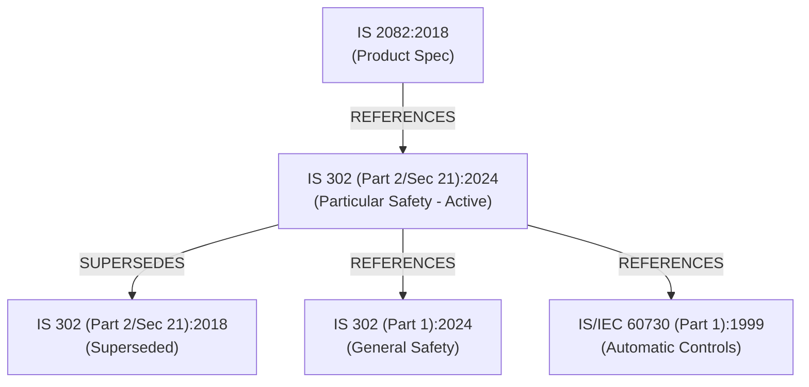

# Knowledge Base & Standards Graph

ManakSetu operates on a curated, verified knowledge base of Indian Standards (BIS) and their normative relationships.

---

## 1. Curated Standards Corpus

For the SIH prototype, a high-fidelity slice of electrotechnical and safety standards was selected to demonstrate end-to-end multi-standard discovery, normative traversal, and version deprecation.

### Standard 1: IS 2082:2018
- **Title:** Stationary storage type electric water heaters - Specification
- **Type:** Product Specification
- **Classification:** Electrical & Electronics
- **Status:** Active (Year: 2018)
- **Certification Scheme:** Mandatory Certification (BIS Scheme-I / Product Manual)
- **Scope:** Covers stationary storage type electric water heaters for household and similar use intended for heating water on alternating current (ac) supply, having a rated storage capacity between 3 litres and 200 litres.
- **Role in Engine:** Serves as the primary product specification standard for domestic and commercial storage geysers.

### Standard 2: IS 302 (Part 2/Sec 21):2024
- **Title:** Household and Similar Electrical Appliances-Safety Part 2 Particular Requirements Section 21 Storage Water Heaters
- **Type:** Safety Standard
- **Classification:** Electrical & Electronics
- **Status:** Active (Year: 2024)
- **Certification Scheme:** Safety Standard (Mandatory under Quality Control Orders)
- **Scope:** Deals with the safety of stationary storage water heaters for household and similar purposes, their rated voltage being not more than 250 V for single-phase appliances and 480 V for other appliances.
- **Role in Engine:** Active particular safety standard governing thermal cut-outs, insulation resistance, and mechanical pressure safety.

### Standard 3: IS 302 (Part 2/Sec 21):2018
- **Title:** Household and Similar Electrical Appliances-Safety Part 2 Particular Requirements Section 21 Storage Water Heaters
- **Type:** Safety Standard
- **Classification:** Electrical & Electronics
- **Status:** Superseded (Year: 2018)
- **Certification Scheme:** Safety Standard (Superseded)
- **Scope:** Superseded safety specification for stationary storage water heaters. Superseded by the 2024 edition.
- **Role in Engine:** Demonstrates version intelligence and anti-deprecation protection. When cited in user tenders, triggers `NEWER_VERSION` alert.

### Standard 4: IS 302 (Part 1):2024
- **Title:** Household and similar electrical appliances - Safety - Part 1: General requirements
- **Type:** Safety Standard
- **Classification:** Electrical & Electronics
- **Status:** Active (Year: 2024)
- **Certification Scheme:** Horizontal Safety Standard
- **Scope:** Deals with the general safety of electrical appliances for household and similar purposes, rated up to 250 V single-phase / 480 V polyphase.
- **Role in Engine:** Horizontal parent safety standard normatively referenced by all particular appliance safety standards.

### Standard 5: IS/IEC 60730 (Part 1):1999
- **Title:** Automatic Electrical Controls for Household and Similar Use - Part 1: General Requirements
- **Type:** Safety & Control Standard
- **Classification:** Electrical & Electronics
- **Status:** Active (Year: 1999)
- **Certification Scheme:** Component Safety & Control Standard
- **Scope:** Applies to automatic electrical controls for use in, on, or in association with equipment for household and similar use, including controls for heating, air-conditioning, and similar applications.
- **Role in Engine:** Component-level control standard pulled in through normative references.

### Standard 6: IS 16923 (Part 1):2018 (Negative Control)
- **Title:** Thermocouples Part 1 — EMF Specifications and Tolerances
- **Type:** Measurement Standard
- **Classification:** Instruments & Sensors
- **Status:** Active (Year: 2018)
- **Certification Scheme:** Standard
- **Scope:** Specifies reference functions and tolerances for letter-designated thermocouples. Not applicable to household water heating appliances.
- **Role in Engine:** Serves as a domain-negative baseline to verify that unrelated electrotechnical sensors are not erroneously recommended.

---

## 2. Normative Relationships

Relationships form a directed graph stored in the `standard_relationships` table:



| Source Standard | Target Standard | Relationship Type | Meaning |
| :--- | :--- | :--- | :--- |
| `IS 302 (Part 2/Sec 21):2024` | `IS 302 (Part 2/Sec 21):2018` | `SUPERSEDES` | 2024 edition officially replaces the 2018 edition. |
| `IS 302 (Part 2/Sec 21):2024` | `IS 302 (Part 1):2024` | `REFERENCES` | General electrical safety standard normatively invoked. |
| `IS 302 (Part 2/Sec 21):2024` | `IS/IEC 60730 (Part 1):1999` | `REFERENCES` | Thermostats and thermal cut-outs must comply with IEC control rules. |
| `IS 2082:2018` | `IS 302 (Part 2/Sec 21):2024` | `REFERENCES` | The water heater product spec mandates compliance with the safety code. |

---

## 3. Database Schema

The database is implemented in SQLite using SQLAlchemy 2.0.

### Standards Table (`standards`)
```sql
CREATE TABLE standards (
    id INTEGER PRIMARY KEY AUTOINCREMENT,
    standard_number VARCHAR(100) UNIQUE NOT NULL,
    title VARCHAR(300) NOT NULL,
    scope TEXT NOT NULL,
    standard_type VARCHAR(100) NOT NULL,
    classification VARCHAR(100) NOT NULL,
    certification_status VARCHAR(150) NOT NULL,
    status VARCHAR(50) NOT NULL,
    year INTEGER NOT NULL,
    description TEXT,
    source_reference TEXT,
    meta_info JSON
);
```

### Relationships Table (`standard_relationships`)
```sql
CREATE TABLE standard_relationships (
    id INTEGER PRIMARY KEY AUTOINCREMENT,
    source_standard_id INTEGER NOT NULL REFERENCES standards(id),
    target_standard_id INTEGER NOT NULL REFERENCES standards(id),
    relationship_type VARCHAR(50) NOT NULL,
    description TEXT
);
```

### Analysis History Table (`analyses`)
```sql
CREATE TABLE analyses (
    id VARCHAR(36) PRIMARY KEY,
    original_requirement TEXT NOT NULL,
    structured_requirement JSON NOT NULL,
    recommendations JSON NOT NULL,
    version_alerts JSON NOT NULL,
    created_at TIMESTAMP NOT NULL
);
```

---

## 4. Extending the Knowledge Base

To add new standards or expand the graph:

1. Edit [`backend/app/seed/seed_standards.py`](../backend/app/seed/seed_standards.py) to append entries to `STANDARDS_DATA` and `RELATIONSHIPS_DATA`.
2. Run the seeder and vector cache rebuilder:
   ```bash
   python scripts/seed_database.py
   python scripts/build_vectors.py
   ```
3. The SHA-256 fingerprint will update automatically, ensuring the semantic cache matches the new database state.
